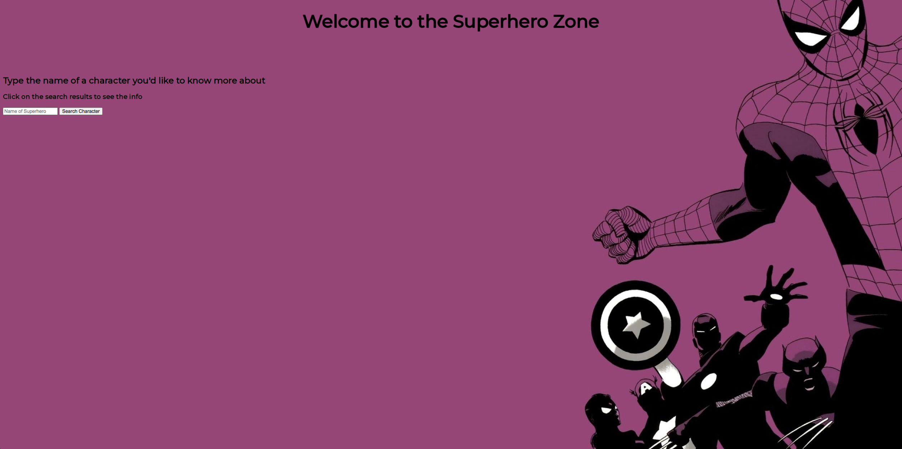
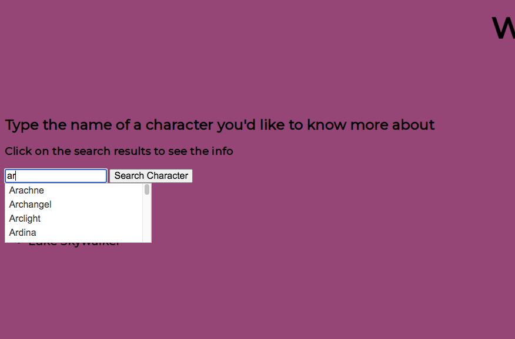
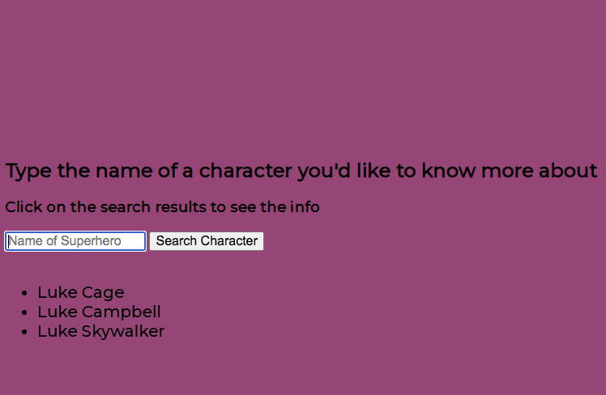
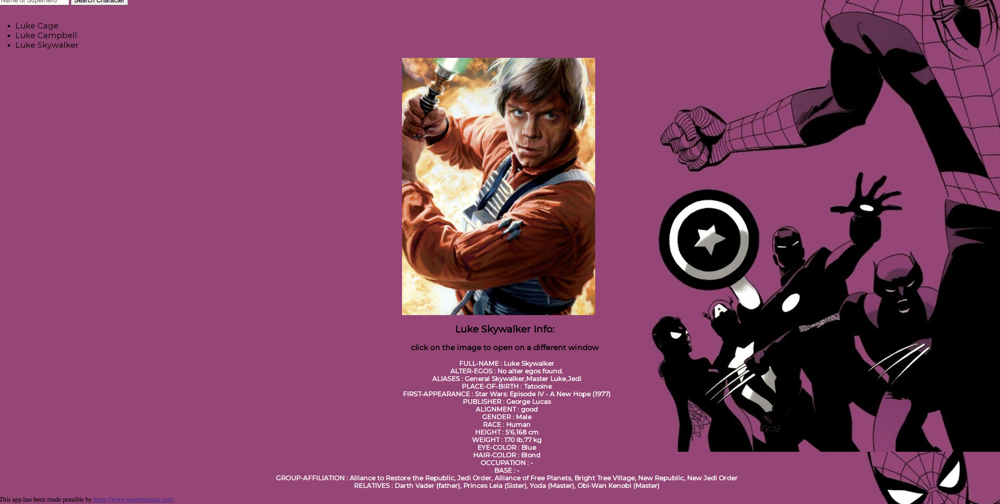

# The Superhero Zone

## Description:

This app provides general information and an image about a vast number of characters of many differents fictitional universes, wether is a character from Marvel Comics, Star Wars, DC comics, etc. 

## Technologies used

- JavaScript
- Html
- CSS
- JQuery

## Getting Started:

https://rvelarde83.github.io/superHeroApiProject1/

The app works with an input box, where you type the name of the character (autocomplete shows options) and after clicking on the Search Character button you receive either a list of possible results or an error message indicating that the character was not found (spelling, dashes or spaces could be a factor, although shows the name as you'll find it in the data base), when you click on any of the names of the search results list you'll see the image and the information appear, if you decide to click on the image it will open itself in a new tab, also you can keep clicking different names of the search results list until you find what you're looking for. If you start a new search the screen will reset itself so you get a fresh space to display new results.

---

## Images 
- First look:

- Autocomplete in action

- Example of clickable search results list being displayed:

- Info being displayed:

---
## Future Enhancements

- Improvements on styling and displaying of content in a more dynamic way.
- Show results for related content to be displayed afterwards (for example, if one searches for Batman then Robin, Alfred, the Joker, may appear as related suggestions).

---

## Developing the code

The following sections shows the way the code was developed originally, first by imagining the user experience and then by going over some of the the steps needed to take, as the app evolved some issues were solved in different ways...

---

### User Stories:

- Opens website, finds a search box.
- Types name of Superhero, clicks search, once clicking, search box erases itself.
-  Gets options of names (different characters that have similar names).
- Clicks on whichever seems right.
- Gets info on that specific character and an image.
- Goes back to the search box, and when they search for another. item, by clicking on the search box it cleans the screen so you can get a fresh look and display the results of the new search.

---

### Pseudo-code

- Input box, greeting, instruction etc.
-  need a function that calls the API and creates the field for search results that are going to be displayed once first search has been init.
- I need another function that works with whatever name the user clicked on, function should know what name is that, grab that, put it in another API call (maybe the same one?)
and retrieve info on the character and the picture...
- Then the steps to clean the screen.
- Then the css and styling.
- Going into sequentail ajax calls, how to handle them...

 - Actually ....no need for sequential $.ajax calls, the first call to the api, using the name of the character offers an object that has withing it all the info that you would eventually get if you performed the call using the character id, so no need to do that. Once the first call has been done, all the info necessary can be extracted from there.

- Thinking about adding a key hit, so after typing on the input box you just hit "enter" and you get the results anyway.
- Also adding the alt quality to the pictures.
- Another thing would be to click on the picture and opening it on a separate window on its own**

